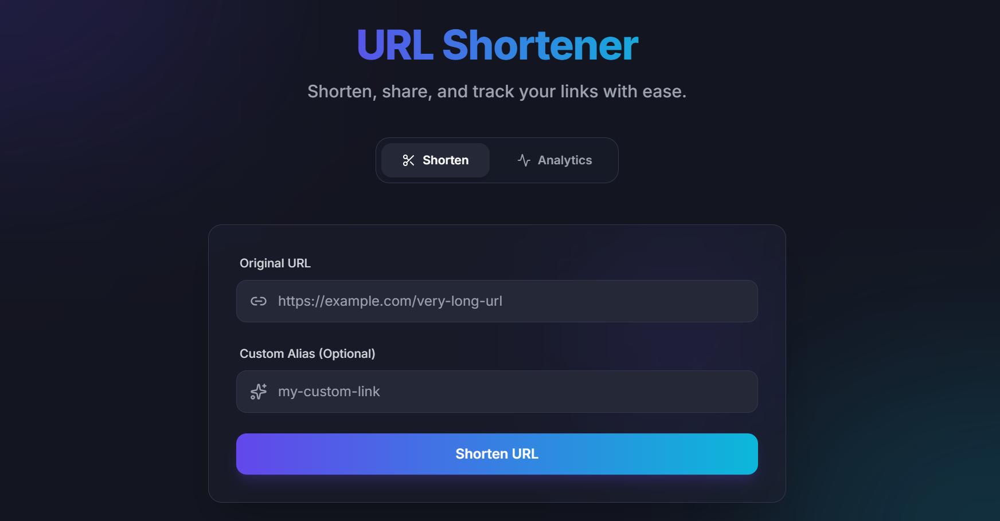

# URL Shortener

A full-stack URL shortener built with Node.js, Express, MongoDB, and Redis — featuring custom Base62 encoding, cache-aside caching, rate limiting, click analytics, and custom aliases.



---

**Live demo:** [Frontend](https://url-shortener-liard-eta.vercel.app/) · [Backend API](https://url-shortener-bzxt.onrender.com)

---

## Features

- **Custom Base62 encoding** — short codes are generated from an incrementing counter and encoded from scratch (no `nanoid`/`shortid`), guaranteeing collision-free codes without random-retry logic.
- **Redis-backed atomic counter** — uses `INCR` for safe, race-condition-free sequence generation under concurrent requests.
- **Cache-aside caching** — redirect lookups check Redis first and fall back to MongoDB on a cache miss, repopulating the cache afterward. Significantly reduces average redirect latency.
- **Bidirectional caching** — both `shortCode → originalUrl` and `originalUrl → shortCode` are cached, keeping both the redirect and duplicate-check paths fast.
- **Duplicate detection** — shortening the same long URL twice returns the existing short code instead of creating a new entry.
- **URL validation & basic SSRF protection** — rejects malformed URLs, non-http(s) protocols.
- **Loop prevention** — blocks shortening a URL that already points back to this service.
- **Custom aliases** — users can choose their own short code instead of an auto-generated one.
- **Rate limiting** — Redis-backed request limiting on the shorten endpoint to prevent abuse.
- **Click analytics** — every redirect increments a click counter; stats can be looked up by either the short URL or the original URL.
- **Link expiration** — optional TTL on links via a MongoDB TTL index.
- **Environment-based config** — the same codebase runs locally or in production, differing only in environment variables.

---

## Tech Stack

| Layer | Technology |
|---|---|
| Backend | Node.js, Express |
| Database | MongoDB (Atlas) |
| Cache / Counter | Redis (Upstash) |
| Frontend | React |
| Rate limiting | `express-rate-limit` + `rate-limit-redis` |
| Backend hosting | Render |
| Frontend hosting | Vercel |

---

## Project Structure

```
url-shortener/
├── backend/
│   ├── server.js
│   ├── config/
│   │   └── redisClient.js
|   |   ├──dbConnection.js
│   ├── models/
│   │   └── Url.js
│   ├── utils/
│   │   ├── base62.js
│   │   ├── validateUrl.js
│   │   └── getNextSequence.js
│   ├── middleware/
│   │   └── rateLimiter.js
│   ├── services/
│   │   └── shortUrl.js
|   |   ├──redirect.js
|   |   ├──stats.js
│   └── routes/
│       ├── urlRoutes.js
│       
└── frontend/
    ├── src/
    └── ...
```

---

## Getting Started (Local Development)

### Prerequisites

- Node.js (v18+)
- A MongoDB Atlas account (free tier) or local MongoDB instance
- A Redis instance — either [Upstash](https://upstash.com) (free tier, no install needed) or Docker locally

### 1. Clone the repo

```bash
git clone https://github.com/ArYann-13/URL-Shortener
cd url-shortener
```

### 2. Backend setup

```bash
cd backend
npm install
```

Create a `.env` file in `backend/`:

```bash
PORT=3000
MONGO_URI=mongodb+srv://<username>:<password>@cluster0.xxxxx.mongodb.net/urlshortener?retryWrites=true&w=majority
REDIS_URL=redis://localhost:6379
BASE_URL=http://localhost:3000
CORS_ORIGIN=http://localhost:5173
COUNTER_START=100000000
```


Start the backend:

```bash
npm start
```

### 3. Frontend setup

```bash
cd frontend
npm install
```

Create a `.env` file in `frontend/`:

```bash
REACT_APP_API_URL=http://localhost:3000
```

Start the frontend:

```bash
npm run dev
```

---

## Deployment

### Backend → Render

1. Create a new **Web Service** on [Render](https://render.com), connected to this repo.
2. Set **Root Directory** to `backend`.
3. Build command: `npm install` · Start command: `node server.js`.
4. Add environment variables (`MONGO_URI`, `REDIS_URL`, `BASE_URL`, `CORS_ORIGIN`, `COUNTER_START`) in the Render dashboard.

### Frontend → Vercel

1. Import the repo on [Vercel](https://vercel.com).
2. Set **Root Directory** to `frontend`.
3. Add `VITE_API_URL` pointing to your Render backend URL.

### Database & Cache

- **MongoDB Atlas**: create a free M0 cluster, a database user, and allow access from anywhere (`0.0.0.0/0`) under Network Access.
- **Upstash**: create a free Redis database and copy the TCP connection string (`rediss://...`) into `REDIS_URL`.

---

## API Reference

### `POST /shortUrl`

Create a shortened URL.

**Request body:**
```json
{
  "originalUrl": "https://example.com/some/long/path",
  "customAlias": "my-link"   // optional
}
```

**Response:**
```json
{
  "shortUrl": "https://url-shortener-bzxt.onrender.com/6xK9p2"
}
```

Rate limited to 20 requests per IP per 15-minute window.

### `GET /:shortCode`

Redirects to the original URL. Returns `404` if not found, `410` if expired.

### `GET /stats?input=<shortUrl>`

Look up click stats by short URL.

**Response:**
```json
{
  "shortUrl": "https://url-shortener-bzxt.onrender.com/6xK9p2",
  "originalUrl": "https://example.com/some/long/path",
  "clicks": 42,
  "createdAt": "2026-01-15T10:00:00.000Z"
}
```

---

## How It Works

1. **Shortening:** a request checks Redis for an existing mapping of the long URL, falls back to MongoDB, and — if genuinely new — pulls the next value from a Redis-backed atomic counter, encodes it to Base62, and stores the mapping in both MongoDB (durable) and Redis (cache).
2. **Redirecting:** a request checks Redis first; on a cache hit it redirects immediately. On a miss, it queries MongoDB, redirects, and repopulates the cache for next time.
3. **Rate limiting:** request counts per IP are tracked in Redis, so limits hold consistently even across multiple server instances.

---

## Known Limitations / Future Improvements

- No user accounts — links aren't currently associated with a user, so there's no "my links" dashboard.
- SSRF protection doesn'tblocks known private IP ranges and hostnames and resolve DNS to catch a public domain pointing at a private IP.
- Free-tier hosting (Render) spins down after inactivity, causing a cold-start delay (~30-60s) on the first request after idling.

---

## License

Made by Aryan
